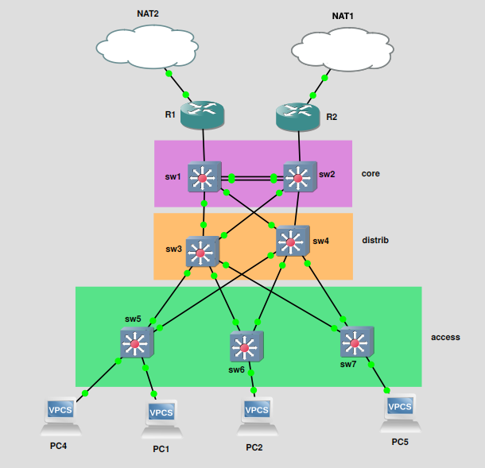

# TP7 INFRA : 3-tier architecture et redondance

Allez on achève la partie réseau pure avec une archi super classique.

Le router-on-a-stick du TP4 c'est classique pour des petits réseaux. C'est un cas réel que vous pourrez croiser.

Le routage dynamique à la OSPF c'est utile que si vous avez une TRES grosse archi. Donc le TP6 OSPF était très... fictif. Genre autant de routeurs que de clients hihi, nawak.

Dans ce TP7, on va se positionner un peu entre les deux, et monter une archi qui est très proche de ce qu'on peut voir dans la réalité. En profitant d'un nouveau TP, comme toujours, pour ajouter quelques nouvelles notions, mixer le tout avec ce qu'on a vu jusqu'alors, et faire un beau TP meow.

Au menu :

- **une archi 3-tier**
  - *core/distribution/access*
- des **VLANs** partout
- une petit config **NAT** pour filer un accès internet
- **HSRP**
  - deux routeurs qui servent de gateways, mais une seule IP de passerelle !
  - les deux routeurs se partagent l'IP
  - on parle de façon générique de VIP : IP virtuelle
  - avec Cisco, HSRP c'est un des protocoles de référence pour faire ça
  - **redondance routeur**
- **LACP (Etherchannel)**
  - pour relier deux équipements réseau entre eux
  - pas avec un mais deux câbles
  - **redondance des liens**
- **Bonus ACL**
  - pour limiter un peu l'accès à tout dans tous les sens
  - certains clients ne peuvent pas joindre certaines autres machines du réseau
- **STP**
  - il tourne toujours en fond le bougre
  - vous allez voir comment il se comporte avec des VLANs

Vu qu'on crée de la **redondance**, on finit le TP par shutdown des machines, débrancher des câbles (simulation de panne) et s'en foutre parce que tout est redondé ! :)


## Sommaire

- [TP7 INFRA : 3-tier architecture et redondance](#tp7-infra--3-tier-architecture-et-redondance)
  - [Sommaire](#sommaire)
  - [0. Setup](#0-setup)
  - [1. Présentation archi](#1-présentation-archi)
    - [A. Topologie réseau](#a-topologie-réseau)
    - [B. Tableau d'adressage](#b-tableau-dadressage)
    - [C. Tableau des VLANs](#c-tableau-des-vlans)
  - [2. Technos utilisées](#2-technos-utilisées)
    - [A. LACP Etherchannel](#a-lacp-etherchannel)
    - [B. HSRP](#b-hsrp)
    - [C. VLAN](#c-vlan)
    - [D. NAT](#d-nat)
    - [E. Preuve et rendu](#e-preuve-et-rendu)
  - [3. Bonus](#3-bonus)
    - [A. ACL](#a-acl)
    - [B. Spanning-tree](#b-spanning-tree)
    - [C. Observe then destroy then observe](#c-observe-then-destroy-then-observe)
    - [D. DHCP Helper](#d-dhcp-helper)

## 0. Setup

- GNS old friend
- du switch et du routeur Cisco
- que du VPCS
  - tu peux spawn des VMs à la place si tu préfères et que ton PC tolère

Dans ce TP, pas d'étape préliminaire, on step-up, je vous donne l'archi, toutes les instructions, et vous vous démerdez !

## 1. Présentation archi

### A. Topologie réseau



### B. Tableau d'adressage

| Machine - Réseau  | `10.7.10.0/24` | `10.7.20.0/24` | `10.7.30.0/24` |
| ----------------- | -------------- | -------------- | -------------- |
| `r1.tp7.b1`       | `10.7.10.252`  | `10.7.20.252`  | `10.7.30.252`  |
| `r2.tp7.b1`       | `10.7.10.253`  | `10.7.20.253`  | `10.7.30.253`  |
| IP virtuelle HSRP | `10.7.10.254`  | `10.7.20.254`  | `10.7.30.254`  |
| `pc4.tp7.b1`      | `10.7.10.11`   | ❌             | ❌             |
| `pc1.tp7.b1`      | ❌             | `10.7.20.11`   | ❌             |
| `pc2.tp7.b1`      | ❌             | `10.7.20.12`   | ❌             |
| `pc5.tp7.b1`      | ❌             | ❌             | `10.7.30.11`   |

### C. Tableau des VLANs

- Association VLAN <> réseau IP

| VLAN              | VLAN 10 `clients` | VLAN 20 `admins` | VLAN 30 `servers` |
| ----------------- | ----------------- | ---------------- | ----------------- |
| Réseau IP associé | `10.7.10.0/24`    | `10.7.20.0/24`   | `10.7.30.0/24`    |

---

- Quel client est dans quel VLAN

| Machine - VLAN | VLAN 10 `clients` | VLAN 20 `admins` | VLAN 30 `servers` |
| -------------- | ----------------- | ---------------- | ----------------- |
| `pc4.tp7.b1`   | ✅                | ❌               | ❌                |
| `pc1.tp7.b1`   | ❌                | ✅               | ❌                |
| `pc2.tp7.b1`   | ❌                | ✅               | ❌                |
| `pc5.tp7.b1`   | ❌                | ❌               | ✅                |

```bash
R1#sh ip int br
Interface                  IP-Address      OK? Method Status                Protocol
FastEthernet0/0            unassigned      YES unset  administratively down down
FastEthernet0/1            unassigned      YES unset  up                    up
FastEthernet0/1.10         10.7.10.252     YES manual up                    up
FastEthernet0/1.20         10.7.20.252     YES manual up                    up
FastEthernet0/1.30         10.7.30.252     YES manual up                    up
FastEthernet1/0            unassigned      YES unset  administratively down down
FastEthernet2/0            unassigned      YES unset  administratively down down

R2#sh ip int br
Interface                  IP-Address      OK? Method Status                Protocol
FastEthernet0/0            unassigned      YES unset  administratively down down
FastEthernet0/1            unassigned      YES unset  up                    up
FastEthernet0/1.10         10.7.10.253     YES manual up                    up
FastEthernet0/1.20         10.7.20.253     YES manual up                    up
FastEthernet0/1.30         10.7.30.253     YES manual up                    up
FastEthernet1/0            unassigned      YES unset  administratively down down
FastEthernet2/0            unassigned      YES unset  administratively down down
```
## 2. Technos utilisées

### A. LACP Etherchannel

➜ **Agrégation de port entre les deux switches core**

- référez-vous au mémo pour mettre en place un Etherchannel
- entre `sw1` et `sw2`

```bash
IOU1#conf t
Enter configuration commands, one per line.  End with CNTL/Z.

IOU1(config)#vlan 10
IOU1(config-vlan)#name clients
IOU1(config-vlan)#exit

IOU1(config)#vlan 20
IOU1(config-vlan)#name admins
IOU1(config-vlan)#exit

IOU1(config)#vlan 30
IOU1(config-vlan)#name servers
IOU1(config-vlan)#exit

IOU1(config)#interface Ethernet0/1
IOU1(config-if)# switchport trunk encapsulation dot1q
IOU1(config-if)# switchport mode trunk
IOU1(config-if)# switchport trunk allowed vlan add 10,20,30
IOU1(config-if)# channel-group 1 mode on
Creating a port-channel interface Port-channel 1

IOU1(config-if)# no shut
IOU1(config-if)#exit

IOU1(config)#interface Ethernet0/2
IOU1(config-if)# switchport trunk encapsulation dot1q
IOU1(config-if)# switchport mode trunk
IOU1(config-if)# switchport trunk allowed vlan add 10,20,30
IOU1(config-if)# channel-group 1 mode on
IOU1(config-if)# no shut
IOU1(config-if)#exit
IOU1(config)#exit
```
```bash
IOU2#conf t
Enter configuration commands, one per line.  End with CNTL/Z.

IOU2(config)#vlan 10
IOU2(config-vlan)#name clients
IOU2(config-vlan)#exit

IOU2(config)#vlan 20
IOU2(config-vlan)#name admins
IOU2(config-vlan)#exit

IOU2(config)#vlan 30
IOU2(config-vlan)#name servers
IOU2(config-vlan)#exit

IOU2(config)#interface Ethernet0/1
IOU2(config-if)# switchport trunk encapsulation dot1q
IOU2(config-if)# switchport mode trunk
IOU2(config-if)# switchport trunk allowed vlan add 10,20,30
IOU2(config-if)# channel-group 1 mode on
Creating a port-channel interface Port-channel 1

IOU2(config-if)# no shut
IOU2(config-if)#exit

IOU2(config)#interface Ethernet0/2
IOU2(config-if)# switchport trunk encapsulation dot1q
IOU2(config-if)# switchport mode trunk
IOU2(config-if)# switchport trunk allowed vlan add 10,20,30
IOU2(config-if)# channel-group 1 mode on
IOU2(config-if)# no shut
IOU2(config-if)#exit

IOU2(config)#exit
IOU2#exit
```
```bash
IOU1#show etherchannel
                Channel-group listing:
                ----------------------

Group: 1
----------
Group state = L2
Ports: 2   Maxports = 4
Port-channels: 1 Max Port-channels = 1
Protocol:    -
Minimum Links: 0
```
```bash
IOU2#show etherchannel
                Channel-group listing:
                ----------------------

Group: 1
----------
Group state = L2
Ports: 2   Maxports = 4
Port-channels: 1 Max Port-channels = 1
Protocol:    -
Minimum Links: 0
```

### B. HSRP

➜ **IP virtuelle entre les deux routeurs**

- les routeurs, pour chacune de leurs sous-interfaces, doivent partager une IP
- priorités :
  - `r1` doit être prioritaire pour `10.7.10.0/24` et `10.7.20.0/24`
  - `r2` doit être prioritaire pour `10.7.30.0/24`

```bash
R1#conf t
Enter configuration commands, one per line.  End with CNTL/Z.

R1(config)#interface FastEthernet0/1.10
R1(config-subif)# ip address 10.7.10.252 255.255.255.0
R1(config-subif)# no shutdown
R1(config-subif)# standby 10 ip 10.7.10.254
R1(config-subif)# standby 10 priority 150
R1(config-subif)# standby 10 preempt
R1(config-subif)#exit

R1(config)#interface FastEthernet0/1.20
R1(config-subif)# ip address 10.7.20.252 255.255.255.0
R1(config-subif)# no shutdown
R1(config-subif)# standby 10 ip 10.7.20.254
R1(config-subif)# standby 10 priority 150
R1(config-subif)# standby 10 preempt
R1(config-subif)#exit

R1(config)#interface FastEthernet0/1.30
R1(config-subif)# ip address 10.7.30.252 255.255.255.0
R1(config-subif)# no shutdown
R1(config-subif)# standby 10 ip 10.7.30.254
R1(config-subif)# standby 10 priority 100
R1(config-subif)# standby 10 preempt
R1(config-subif)#exit

R1(config)#exit

R1#show standby brief
                     P indicates configured to preempt.
                     |
Interface   Grp  Pri P State   Active          Standby         Virtual IP
Fa0/1.10    10   150 P Active  local           unknown         10.7.10.254
Fa0/1.20    10   150 P Active  local           unknown         10.7.20.254
Fa0/1.30    10   100 P Active  local           unknown         10.7.30.254
```
```bash
R2#conf t
Enter configuration commands, one per line.  End with CNTL/Z.

R2(config)#interface FastEthernet0/1.10
R2(config-subif)# ip address 10.7.10.253 255.255.255.0
R2(config-subif)# no shutdown
R2(config-subif)# standby 10 ip 10.7.10.254
R2(config-subif)# standby 10 priority 100
R2(config-subif)# standby 10 preempt
R2(config-subif)#exit

R2(config)#interface FastEthernet0/1.20
R2(config-subif)# ip address 10.7.20.253 255.255.255.0
R2(config-subif)# no shutdown
R2(config-subif)# standby 10 ip 10.7.20.254
R2(config-subif)# standby 10 priority 100
R2(config-subif)# standby 10 preempt
R2(config-subif)#exit

R2(config)#interface FastEthernet0/1.30
R2(config-subif)# ip address 10.7.30.253 255.255.255.0
R2(config-subif)# no shutdown
R2(config-subif)# standby 10 ip 10.7.30.254
R2(config-subif)# standby 10 priority 150
R2(config-subif)# standby 10 preempt
R2(config-subif)#exit

R2(config)#exit

R2#show standby brief
                     P indicates configured to preempt.
                     |
Interface   Grp  Pri P State   Active          Standby         Virtual IP
Fa0/1.10    10   100 P Active  local           unknown         10.7.10.254
Fa0/1.20    10   100 P Active  local           unknown         10.7.20.254
Fa0/1.30    10   150 P Active  local           unknown         10.7.30.254
```

### C. VLAN

➜ **VLANs everywhere**

- sur les switches :
  - trunk entre tous les équipements réseau
    - autorisez tous les VLANs à circuler partout
  - access vers les clients
    - référez-vous au tableau au dessus pour savoir quel client est dans quel VLAN
- sur les routeurs :
  - sous-interface pour permettre le routage inter-VLAN

```bash
IOU5#sh vlan br

VLAN Name                             Status    Ports
---- -------------------------------- --------- -------------------------------
1    default                          active    Et1/0, Et1/1, Et1/2, Et1/3
                                                Et2/0, Et2/1, Et2/2, Et2/3
                                                Et3/0, Et3/1, Et3/2, Et3/3
10   clients                          active    Et0/2
20   admins                           active    Et0/3
30   servers                          active
1002 fddi-default                     act/unsup
1003 token-ring-default               act/unsup
1004 fddinet-default                  act/unsup
1005 trnet-default                    act/unsup

IOU5#sh int trunk

Port        Mode             Encapsulation  Status        Native vlan
Et0/0       on               802.1q         trunking      1
Et0/1       on               802.1q         trunking      1

Port        Vlans allowed on trunk
Et0/0       1-4094
Et0/1       1-4094

Port        Vlans allowed and active in management domain
Et0/0       1,10,20,30
Et0/1       1,10,20,30

Port        Vlans in spanning tree forwarding state and not pruned
Et0/0       1,10,20,30
Et0/1       1,10,20,30
IOU5#
```
```bash
IOU6#sh vlan br

VLAN Name                             Status    Ports
---- -------------------------------- --------- -------------------------------
1    default                          active    Et0/3, Et1/0, Et1/1, Et1/2
                                                Et1/3, Et2/0, Et2/1, Et2/2
                                                Et2/3, Et3/0, Et3/1, Et3/2
                                                Et3/3
10   clients                          active
20   admins                           active    Et0/2
30   servers                          active
1002 fddi-default                     act/unsup
1003 token-ring-default               act/unsup
1004 fddinet-default                  act/unsup
1005 trnet-default                    act/unsup

IOU6#sh int trunk

Port        Mode             Encapsulation  Status        Native vlan
Et0/0       on               802.1q         trunking      1
Et0/1       on               802.1q         trunking      1

Port        Vlans allowed on trunk
Et0/0       1-4094
Et0/1       1-4094

Port        Vlans allowed and active in management domain
Et0/0       1,10,20,30
Et0/1       1,10,20,30

Port        Vlans in spanning tree forwarding state and not pruned
Et0/0       1,10,20,30
Et0/1       1,10,20,30
```
```bash
IOU7#sh vlan br

VLAN Name                             Status    Ports
---- -------------------------------- --------- -------------------------------
1    default                          active    Et0/3, Et1/0, Et1/1, Et1/2
                                                Et1/3, Et2/0, Et2/1, Et2/2
                                                Et2/3, Et3/0, Et3/1, Et3/2
                                                Et3/3
10   clients                          active
20   admins                           active
30   servers                          active    Et0/2
1002 fddi-default                     act/unsup
1003 token-ring-default               act/unsup
1004 fddinet-default                  act/unsup
1005 trnet-default                    act/unsup

IOU7#sh int trunk

Port        Mode             Encapsulation  Status        Native vlan
Et0/0       on               802.1q         trunking      1
Et0/1       on               802.1q         trunking      1

Port        Vlans allowed on trunk
Et0/0       1-4094
Et0/1       1-4094

Port        Vlans allowed and active in management domain
Et0/0       1,10,20,30
Et0/1       1,10,20,30

Port        Vlans in spanning tree forwarding state and not pruned
Et0/0       1,10,20,30
Et0/1       1,10,20,30
```
```bash
IOU3#sh int trunk

Port        Mode             Encapsulation  Status        Native vlan
Et0/0       on               802.1q         trunking      1
Et0/1       on               802.1q         trunking      1
Et0/2       on               802.1q         trunking      1
Et0/3       on               802.1q         trunking      1
Et1/0       on               802.1q         trunking      1

Port        Vlans allowed on trunk
Et0/0       1-4094
Et0/1       1-4094
Et0/2       1-4094
Et0/3       1-4094
Et1/0       1-4094

Port        Vlans allowed and active in management domain
Et0/0       1,10,20,30
Et0/1       1,10,20,30
Et0/2       1,10,20,30
Et0/3       1,10,20,30
Et1/0       1,10,20,30

Port        Vlans in spanning tree forwarding state and not pruned
Et0/0       1,10,20,30
Et0/1       1,10,20,30
Et0/2       1,10,20,30
Et0/3       1,10,20,30
Et1/0       1,10,20,30
```
```bash
IOU4#sh int trunk

Port        Mode             Encapsulation  Status        Native vlan
Et0/0       on               802.1q         trunking      1
Et0/1       on               802.1q         trunking      1
Et0/2       on               802.1q         trunking      1
Et0/3       on               802.1q         trunking      1
Et1/0       on               802.1q         trunking      1

Port        Vlans allowed on trunk
Et0/0       1-4094
Et0/1       1-4094
Et0/2       1-4094
Et0/3       1-4094
Et1/0       1-4094

Port        Vlans allowed and active in management domain
Et0/0       1,10,20,30
Et0/1       1,10,20,30
Et0/2       1,10,20,30
Et0/3       1,10,20,30
Et1/0       1,10,20,30

Port        Vlans in spanning tree forwarding state and not pruned
Et0/0       none
Et0/1       none
Et0/2       none
Et0/3       none
Et1/0       1,10,20,30
```
```bash
IOU1#sh int trunk

Port        Mode             Encapsulation  Status        Native vlan
Et0/0       on               802.1q         trunking      1
Et0/3       on               802.1q         trunking      1
Et1/0       on               802.1q         trunking      1
Po1         on               802.1q         trunking      1

Port        Vlans allowed on trunk
Et0/0       1-4094
Et0/3       1-4094
Et1/0       1-4094
Po1         1-4094

Port        Vlans allowed and active in management domain
Et0/0       1,10,20,30
Et0/3       1,10,20,30
Et1/0       1,10,20,30
Po1         1,10,20,30

Port        Vlans in spanning tree forwarding state and not pruned
Et0/0       1,10,20,30
Et0/3       1,10,20,30
Et1/0       1,10,20,30
Po1         1,10,20,30
```
```bash
IOU2#sh int trunk

Port        Mode             Encapsulation  Status        Native vlan
Et0/0       on               802.1q         trunking      1
Et0/3       on               802.1q         trunking      1
Et1/0       on               802.1q         trunking      1
Po1         on               802.1q         trunking      1

Port        Vlans allowed on trunk
Et0/0       1-4094
Et0/3       1-4094
Et1/0       1-4094
Po1         1-4094

Port        Vlans allowed and active in management domain
Et0/0       1,10,20,30
Et0/3       1,10,20,30
Et1/0       1,10,20,30
Po1         1,10,20,30

Port        Vlans in spanning tree forwarding state and not pruned
Et0/0       1,10,20,30
Et0/3       1,10,20,30
Et1/0       1,10,20,30
Po1         none
```
```bash
R1#sh ip int br
Interface                  IP-Address      OK? Method Status                Protocol
FastEthernet0/0            unassigned      YES NVRAM  administratively down down
FastEthernet0/1            unassigned      YES NVRAM  up                    up
FastEthernet0/1.10         10.7.10.252     YES NVRAM  up                    up
FastEthernet0/1.20         10.7.20.252     YES NVRAM  up                    up
FastEthernet0/1.30         10.7.30.252     YES NVRAM  up                    up
FastEthernet1/0            unassigned      YES NVRAM  administratively down down
FastEthernet2/0            unassigned      YES NVRAM  administratively down down
```
```bash
R2#sh ip int br
Interface                  IP-Address      OK? Method Status                Protocol
FastEthernet0/0            unassigned      YES NVRAM  administratively down down
FastEthernet0/1            unassigned      YES NVRAM  up                    up
FastEthernet0/1.10         10.7.10.253     YES NVRAM  up                    up
FastEthernet0/1.20         10.7.20.253     YES NVRAM  up                    up
FastEthernet0/1.30         10.7.30.253     YES NVRAM  up                    up
FastEthernet1/0            unassigned      YES NVRAM  administratively down down
FastEthernet2/0            unassigned      YES NVRAM  administratively down down
```
### D. NAT

➜ **Config NAT sur les deux routeurs**

- ils doivent permettre de joindre l'extérieur
```bash
R1(config)#int fastEthernet0/0
R1(config-if)#no shut
R1(config-if)#ip nat outside
R1(config-if)#exit

R1(config)#int fastEthernet0/1
R1(config-if)#ip nat inside
R1(config-if)#exit

R1(config)#int fastEthernet0/1.10
R1(config-subif)#ip nat inside
R1(config-subif)#exit

R1(config)#int fastEthernet0/1.20
R1(config-subif)#ip nat inside
R1(config-subif)#exit

R1(config)#int fastEthernet0/1.30
R1(config-subif)#ip nat inside
R1(config-subif)#exit

R1(config)#access-list 1 permit any
R1(config)#ip nat inside source list 1 interface fastEthernet0/0 overload
R1(config)#exit
```
```bash
R2(config)#int fastEthernet0/0
R2(config-if)#no shut
R2(config-if)#ip nat outside
R2(config-if)#exit

R2(config)#int fastEthernet0/1
R2(config-if)#ip nat inside
R2(config-if)#exit

R2(config)#int fastEthernet0/1.10
R2(config-subif)#ip nat inside
R2(config-subif)#exit

R2(config)#int fastEthernet0/1.20
R2(config-subif)#ip nat inside
R2(config-subif)#exit

R2(config)#int fastEthernet0/1.30
R2(config-subif)#ip nat inside
R2(config-subif)#exit

R2(config)#access-list 1 permit any
R2(config)#ip nat inside source list 1 interface fastEthernet0/0 overload
R2(config)#exit
```
### E. Preuve et rendu

🌞 **`show-run`** sur tous les équipements
```bash
R1#sh running-config
Building configuration...

interface FastEthernet0/0
 ip address 192.168.122.124 255.255.255.0
 ip nat outside
 ip virtual-reassembly
 duplex auto
 speed auto
!
interface FastEthernet0/1
 no ip address
 ip nat inside
 ip virtual-reassembly
 duplex auto
 speed auto
!
interface FastEthernet0/1.10
 encapsulation dot1Q 10
 ip address 10.7.10.252 255.255.255.0
 ip nat inside
 ip virtual-reassembly
 standby 10 ip 10.7.10.254
 standby 10 priority 150
 standby 10 preempt
!
interface FastEthernet0/1.20
 encapsulation dot1Q 20
 ip address 10.7.20.252 255.255.255.0
 ip nat inside
 ip virtual-reassembly
 standby 10 ip 10.7.20.254
 standby 10 priority 150
 standby 10 preempt
!
interface FastEthernet0/1.30
 encapsulation dot1Q 30
 ip address 10.7.30.252 255.255.255.0
 ip nat inside
 ip virtual-reassembly
 standby 10 ip 10.7.30.254
 standby 10 preempt
!
interface FastEthernet1/0
 no ip address
 shutdown
 duplex auto
 speed auto
!
interface FastEthernet2/0
 no ip address
 shutdown
 duplex auto
 speed auto
!
ip forward-protocol nd
!
!
no ip http server
no ip http secure-server
ip nat inside source list 1 interface FastEthernet0/0 overload
!
access-list 1 permit any
no cdp log mismatch duplex
!
```
```bash

R2#sh running-config
Building configuration...

interface FastEthernet0/0
 ip address dhcp
 ip nat outside
 ip virtual-reassembly
 duplex auto
 speed auto
!
interface FastEthernet0/1
 no ip address
 ip nat inside
 ip virtual-reassembly
 duplex auto
 speed auto
!
interface FastEthernet0/1.10
 encapsulation dot1Q 10
 ip address 10.7.10.253 255.255.255.0
 ip nat inside
 ip virtual-reassembly
 standby 10 ip 10.7.10.254
 standby 10 preempt
!
interface FastEthernet0/1.20
 encapsulation dot1Q 20
 ip address 10.7.20.253 255.255.255.0
 ip nat inside
 ip virtual-reassembly
 standby 10 ip 10.7.20.254
 standby 10 preempt
!
interface FastEthernet0/1.30
 encapsulation dot1Q 30
 ip address 10.7.30.253 255.255.255.0
 ip nat inside
 ip virtual-reassembly
 standby 10 ip 10.7.30.254
 standby 10 priority 150
 standby 10 preempt
!
interface FastEthernet1/0
 no ip address
 shutdown
 duplex auto
 speed auto
!
interface FastEthernet2/0
 no ip address
 shutdown
 duplex auto
 speed auto
!
ip forward-protocol nd
!
!
no ip http server
no ip http secure-server
ip nat inside source list 1 interface FastEthernet0/0 overload
!
access-list 1 permit any
no cdp log mismatch duplex
```

🌞 **depuis `pc4.tp7.b1`**

- `ping 10.7.20.12`

```bash
PC4> ping 10.7.20.12

84 bytes from 10.7.20.12 icmp_seq=1 ttl=63 time=29.347 ms
84 bytes from 10.7.20.12 icmp_seq=2 ttl=63 time=20.614 ms
```
- `ping ynov.com`
```bash
PC4> ping ynov.com
ynov.com resolved to 104.26.11.233
```
```bash
IOU1#sh running-config
Building configuration...

interface Port-channel1
 switchport trunk encapsulation dot1q
 switchport mode trunk
!
interface Ethernet0/0
 switchport trunk encapsulation dot1q
 switchport mode trunk
!
interface Ethernet0/1
 switchport trunk encapsulation dot1q
 switchport mode trunk
 channel-group 1 mode on
!
interface Ethernet0/2
 switchport trunk encapsulation dot1q
 switchport mode trunk
 channel-group 1 mode on
!
interface Ethernet0/3
 switchport trunk encapsulation dot1q
 switchport mode trunk
!
interface Ethernet1/0
 switchport trunk encapsulation dot1q
 switchport mode trunk
!
```
```bash
IOU2#sh running-config
Building configuration...

interface Port-channel1
 switchport trunk encapsulation dot1q
 switchport mode trunk
!
interface Ethernet0/0
 switchport trunk encapsulation dot1q
 switchport mode trunk
!
interface Ethernet0/1
 switchport trunk encapsulation dot1q
 switchport mode trunk
 channel-group 1 mode on
!
interface Ethernet0/2
 switchport trunk encapsulation dot1q
 switchport mode trunk
 channel-group 1 mode on
!
interface Ethernet0/3
 switchport trunk encapsulation dot1q
 switchport mode trunk
!
interface Ethernet1/0
 switchport trunk encapsulation dot1q
 switchport mode trunk
!
```
```bash
IOU3#sh running-config
Building configuration...

interface Ethernet0/0
 switchport trunk encapsulation dot1q
 switchport mode trunk
!
interface Ethernet0/1
 switchport trunk encapsulation dot1q
 switchport mode trunk
!
interface Ethernet0/2
 switchport trunk encapsulation dot1q
 switchport mode trunk
!
interface Ethernet0/3
 switchport trunk encapsulation dot1q
 switchport mode trunk
!
interface Ethernet1/0
 switchport trunk encapsulation dot1q
 switchport mode trunk
!
```
```bash
IOU4#sh running-config
Building configuration...

interface Ethernet0/0
 switchport trunk encapsulation dot1q
 switchport mode trunk
!
interface Ethernet0/1
 switchport trunk encapsulation dot1q
 switchport mode trunk
!
interface Ethernet0/2
 switchport trunk encapsulation dot1q
 switchport mode trunk
!
interface Ethernet0/3
 switchport trunk encapsulation dot1q
 switchport mode trunk
!
interface Ethernet1/0
 switchport trunk encapsulation dot1q
 switchport mode trunk
!
```
```bash
IOU5#sh running-config
Building configuration...

interface Ethernet0/0
 switchport trunk encapsulation dot1q
 switchport mode trunk
!
interface Ethernet0/1
 switchport trunk encapsulation dot1q
 switchport mode trunk
!
interface Ethernet0/2
 switchport access vlan 10
 switchport mode access
!
interface Ethernet0/3
 switchport access vlan 20
 switchport mode access
!
```
```bash
IOU6#sh running-config
Building configuration...

interface Ethernet0/0
 switchport trunk encapsulation dot1q
 switchport mode trunk
!
interface Ethernet0/1
 switchport trunk encapsulation dot1q
 switchport mode trunk
!
interface Ethernet0/2
 switchport access vlan 20
 switchport mode access
!
```
```bash
IOU7#sh running-config
Building configuration...

interface Ethernet0/0
 switchport trunk encapsulation dot1q
 switchport mode trunk
!
interface Ethernet0/1
 switchport trunk encapsulation dot1q
 switchport mode trunk
!
interface Ethernet0/2
 switchport access vlan 30
 switchport mode access
!

```
## 3. Bonus

### A. ACL

🌞 **Le réseau `10.7.30.0/24`...**

- doit être injoignable depuis les autres réseaux
- SAUF si on essaie de contacter `10.7.30.67`
- genre si on ping cette IP c'est ok (depuis l'un des deux autres réseaux)
- mais si on ping n'importe quelle autre IP de ce réseau, ça fonctionne pas
- créez un VPCS qui porte l'IP `10.7.30.67` pour vos tests

### B. Spanning-tree

🌞 **Configuration de...**

- BPDUGuard
  - protection de trames STP non-désirées
  - genre un hacker se fait passer pour un switch, un voisin STP
- PortFast
  - permet aux ports STP de s'activer plus rapidement
- sur tous les switches

### C. Observe then destroy then observe

🌞 **Vérifier, à l'aide de commandes dédiées**

- l'état de l'agrégation LACP entre `sw1` et `sw2`
- l'état de la liaison HSRP entre `r1` et `r2`
- l'état de STP, par VLAN sur trois switches (un core, un distrib, un access)

🌞 **Couper le routeur prioritaire**

- éteins-le, débranche les câbles, peu importe
- un truc cool c'est le faire PENDANT qu'un client `ping` l'extérieur
  - pour voir, en temps réel, la bascule de l'IP

🌞 **Couper un switch crucial dans la topo STP**

- choisissez bien un switch qui a une place cruciale
  - genre un qui n'a pas tous ses ports en `BLK`
- shut it down !
- observe sur les autres switches la mise à jour de la topologie STP
- tu peux aussi lancer Wireshark sur quelques liens pour voir les trames STP échangées

### D. DHCP Helper

🌞 **Setup un serveur DHCP**

- il a une IP dans `10.7.30.0/24`
- il attribue des IPs aux clients des 3 réseaux
- il est physiquement dans la même salle que `pc5.tp7.b1`
- configuration IP Helper sur les routeurs pour relayer les requêtes dans les 2 autres réseaux (dans lesquels le serveur DHCP ne se trouve pas lui même)