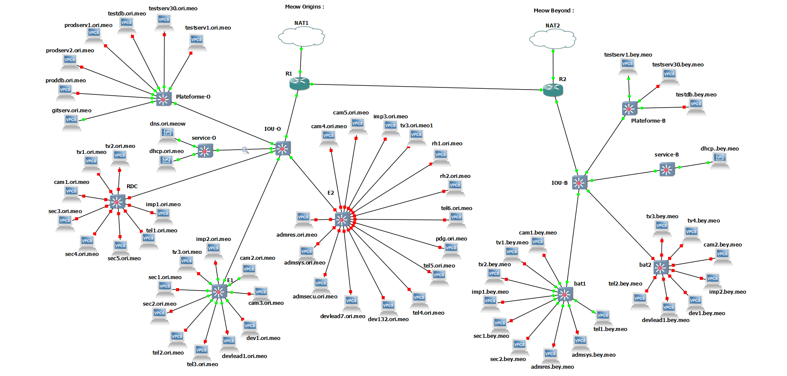

# TP8 INFRA : Make ur own

Dans ce TP on va encore monter d'un cran : on se met (presque) en situation réelle : vous êtes des admins réseau que je prends en presta pour ma boîte fictive.

J'ai actuellement un réseau foireux, et j'aimerai voir ce que me proposerait pour nouvelle architecture un prestataire externe.

> *"Presque" en situation réelle car on ne s'occupe ni de l'aspect pécunier (on va pas estimer la valeur de l'archi, ce ne sera pas un critère), ni de l'aspect physique (on suppose que les différents locaux de la boîte sont directement connectés, on omet la couche internet). De plus, pour la simplicité de l'exercice, on va considérer que chaque machine est physique. Dans un environnement réel, les serveurs sont des machines virtuelles.*

## Sommaire

- [TP8 INFRA : Make ur own](#tp8-infra--make-ur-own)
  - [Sommaire](#sommaire)
  - [I. Expression du besoin](#i-expression-du-besoin)
    - [1. Ptite intro](#1-ptite-intro)
    - [2. Présentation des équipes](#2-présentation-des-équipes)
    - [3. Equipements connectés](#3-equipements-connectés)
    - [4. Salle serveur](#4-salle-serveur)
    - [5. Exigences diverses](#5-exigences-diverses)
    - [6. Considérations spécifiques pour le TP](#6-considérations-spécifiques-pour-le-tp)
  - [II. Rendu attendu](#ii-rendu-attendu)

## I. Expression du besoin

### 1. Ptite intro

On est répartis sur deux sites physiques en France (ou pas) :

- 🍷 **le site "Meow Origins"**
  - locaux à Bordeaux
  - 1 seul bâtiment, 3 étages et un sous-sol
  - y'a une salle serveur au sous-sol
  - architecture type *3-tier architecture*
- 🚀 **le site "Meow and Beyond"**
  - nouveaux locaux !
  - locaux sur la Lune
  - 2 bâtiments, pas d'étage
    - reliés en direct par un câble, ils sont collés !
  - salle serveur dans le bâtiment 1
  - architecture type *router-on-a-stick*
- les deux sites
  - sont directement connectés
  - ont tous les deux un accès direct à internet

On a une volonté de garder la maîtrise sur notre infra, alors on héberge tout en interne.

On est paranos un peu alors il n'y a pas de WiFi dans nos locaux, et on fournit nous-mêmes les postes de travail à nos utilisateurs (les dévs et autres).

### 2. Présentation des équipes

➜ 🍷 **Site "Meow Origins"**

- équipe dév
  - 7 lead devs
  - 132 dévs
  - tous répartis dans deux big open-space étage 1 et étage 2
- équipe admin
  - 1 admin réseau
  - 1 admin sys
  - 1 responsable sécu
  - tous dans l'open-space étage 2
- direction
  - 1 PDG
    - un bureau pour lui étage 2
  - 5 secrétaires/agents d'accueil
    - un bureau dédié étage 1 : ils/elles sont deux
    - rez-de-chaussée  : les 3 restant(e)s
  - 2 agents RH
    - un bureau dédié étage 2

➜ 🚀 **Site "Meow and Beyond"**

- équipe dév
  - 2 lead devs
  - 12 dévs
  - tous dans un open-space dans le bâtiment 2
- équipe admin
  - 1 admin réseau
  - 1 admin sys
  - tous dans un bureau dans le bâtiment 1
- direction
  - 2 secrétaires/agents d'accueil
  - dans un bureau dans le bâtiment 1

### 3. Equipements connectés

➜ **Imprimantes**

- on a une imprimante réseau à chaque étage de chaque bâtiment

➜ **Caméras**

- 2 caméras à chaque étage de chaque bâtiment
- 1 caméra à l'entrée de chaque bâtiment

➜ **Télés**

- 2 télés à l'accueil de chaque bâtiment
- 1 télé à chaque étage hors rez-de-chaussée de chaque bâtiment

➜ **Téléphone IP**

- 1 téléphone IP par employé

### 4. Salle serveur

➜ 🍷 **Site "Meow Origins"**

- serveur DHCP
  - donne des IP à tous les réseaux de clients
  - pas les serveurs/routeurs, etc. (évidemment ! :D)
- serveur DNS
  - permet de résoudre les noms de TOUTES les machines des deux sites
  - notre domaine c'est `dev.meow`
    - par exemple notre serveur DNS c'est `dns.dev.meow`
- plateforme de production
- plateforme de tests
- dépôts git internes
- accès internet
- accès à l'autre site

➜ 🚀 **Site "Meow and Beyond"**

- serveur DHCP
  - donne des IP à tous les réseaux de clients
  - pas les serveurs/routeurs, etc. (évidemment ! :D)
- plateforme de tests
- accès internet
- accès à l'autre site

### 5. Exigences diverses

➜ **Plateforme de test**

- nous avons l'habitude de fournir aux dévs une plateforme de test
- c'est à dire un réseau qui héberge des machines dédiées aux tests des dévs
- ils peuvent se connecter à ces machines et lancer leur code
- ces machines sont (quasiment...) identiques aux machines de production
- actuellement les environnements de test comportent 30 machines
- un serveur de database est aussi présent en plus des 30 serveurs de test

➜ **Production**

- nous avons un réseau dédié qui héberge des serveurs de production
- il existe un serveur dédié à chaque application que nous développons
- en ce moment nous avons donc deux serveurs de production
- un serveur de database est aussi présent en plus, pour servir ces 2 serveurs de production

➜ **Dépôts git**

- on héberge nous-mêmes des dépôts git pour stocker le code produit en interne par nos développeurs
- on a actuellement 1 seul serveur Git hébergé sur le 🍷 **Site "Meow Origins"**

### 6. Considérations spécifiques pour le TP

➜ **Choix des OS**

- les routeurs
  - Cisco ou Rocky Linux
- les switches
  - Cisco
- serveur DHCP
  - Rocky Linux
- serveur DNS
  - Rocky Linux
- tout le reste est simulé
  - VPCS ou Rocky Linux

➜ **Les locaux**

- on considère que les deux sites sont connectés en direct avec un câble
- les deux sites disposent de leur propre accès internet
- les deux sites sont routés en direct, c'est à dire que des machines du site A peuvent ping des machines du site B
- en revanche, aucun réseau IP ni VLAN n'est partagé entre les deux sites
  - on simule une situation réelle où il y a internet entre les deux
  - pas de réseau IP dupliqué des deux côtés

## II. Rendu attendu

➜ Je vous recommande FORTEMENT de suivre la démarche suivante :

- faire un schéma réseau
  - me le soumettre
  - éventuellement l'ajuster en fonction de mes retours
- établir le tableau d'adressage IP/VLAN
- monter la topologie dans GNS
- configurer uniquement la partie L2/L3
  - c'est à dire les switches, les routeurs, accès à internet
- puis passer à la conf des serveurs Linux
  - DHCP et DNS notamment

🌞 **Rendu Markdown**

- comme d'hab quoi
- comporte tous les points qui suivent
  - soit des documents liés
  - soit directement du Markdown

🌞 **Schéma réseau**

🌞 **Tableaux d'adressage et VLAN**

#### 1. Tableau d'adressage

**- Site "Meow Origins" :**

| Machine - Réseau  | `10.10.0.0/23` | `10.20.0.0/28` | `10.30.0.0/27` | `10.40.0.0/24` | `10.50.0.0/28` | `10.60.0.0/28` | `10.70.0.0/28` | `10.80.0.0/23` | `10.90.0.0/28` | `10.8.1.0/30`  |
| ----------------- | -------------- | -------------- | -------------- | -------------- | -------------- | -------------- | -------------- | -------------- | -------------- | -------------- |
| `r1`              | `10.10.1.254`  | `10.20.0.14`   | `10.30.0.30`   | `10.40.0.254`  | `10.50.0.14`   | `10.60.0.14`   | `10.70.0.14`   | `10.80.1.254`  | `10.90.0.14`  | `10.8.1.1/30`  |
| `dev.lead1.O`     | `10.10.0.1`    | ❌            | ❌             | ❌             |  ❌           |  ❌           | ❌             | ❌            | ❌             | ❌             |
| `dev.lead7.O`     | `10.10.0.7`    | ❌            | ❌             | ❌             |  ❌           |  ❌           | ❌             | ❌            | ❌             | ❌             |
| `dev.1.O`         | `10.10.0.8`    | ❌            | ❌             | ❌             |  ❌           |  ❌           | ❌             | ❌            | ❌             | ❌             |
| `dev.132.O`       | `10.10.0.139`  | ❌            | ❌             | ❌             |  ❌           |  ❌           | ❌             | ❌            | ❌             | ❌             |
| `adm.res.O`       | ❌             | `10.20.0.1`   | ❌             | ❌             |  ❌           |  ❌           | ❌             | ❌            | ❌             | ❌             |
| `adm.sys.O`       | ❌             | `10.20.0.2`   | ❌             | ❌             |  ❌           |  ❌           | ❌             | ❌            | ❌             | ❌             |
| `adm.secu.O`      | ❌             | `10.20.0.3`   | ❌             | ❌             |  ❌           |  ❌           | ❌             | ❌            | ❌             | ❌             |
| `pdg`             | ❌             | ❌            | `10.30.0.1`    | ❌             |  ❌           |  ❌           | ❌             | ❌            | ❌             | ❌             |
| `sec.1.O`         | ❌             | ❌            | `10.30.0.2`    | ❌             |  ❌           |  ❌           | ❌             | ❌            | ❌             | ❌             |
| `sec.2.O`         | ❌             | ❌            | `10.30.0.3`    | ❌             |  ❌           |  ❌           | ❌             | ❌            | ❌             | ❌             |
| `sec.3.O`         | ❌             | ❌            | `10.30.0.4`    | ❌             |  ❌           |  ❌           | ❌             | ❌            | ❌             | ❌             |
| `sec.4.O`         | ❌             | ❌            | `10.30.0.5`    | ❌             |  ❌           |  ❌           | ❌             | ❌            | ❌             | ❌             |
| `sec.5.O`         | ❌             | ❌            | `10.30.0.6`    | ❌             |  ❌           |  ❌           | ❌             | ❌            | ❌             | ❌             |
| `rh.1.O`          | ❌             | ❌            | `10.30.0.7`    | ❌             |  ❌           |  ❌           | ❌             | ❌            | ❌             | ❌             |
| `rh.2.O`          | ❌             | ❌            | `10.30.0.8`    | ❌             |  ❌           |  ❌           | ❌             | ❌            | ❌             | ❌             |
| `test.serv1.O`    | ❌             | ❌            | ❌            | `10.40.0.1`     |  ❌           |  ❌           | ❌             | ❌            | ❌             | ❌             |
| `test.serv30.O`   | ❌             | ❌            | ❌            | `10.40.0.2`     |  ❌           |  ❌           | ❌             | ❌            | ❌             | ❌             |
| `test.db.O`       | ❌             | ❌            | ❌            | `10.40.0.3`     |  ❌           |  ❌           | ❌             | ❌            | ❌             | ❌             |
| `prod.serv1.O`    | ❌             | ❌            | ❌            | `10.40.0.4`     |  ❌           |  ❌           | ❌             | ❌            | ❌             | ❌             |
| `prod.serv2.O`    | ❌             | ❌            | ❌            | `10.40.0.5`     |  ❌           |  ❌           | ❌             | ❌            | ❌             | ❌             |
| `prod.db.O`       | ❌             | ❌            | ❌            | `10.40.0.6`     |  ❌           |  ❌           | ❌             | ❌            | ❌             | ❌             |
| `git.serv.O`      | ❌             | ❌            | ❌            | `10.40.0.7`     |  ❌           |  ❌           | ❌             | ❌            | ❌             | ❌             |
| `imp.1.O`         | ❌             | ❌            | ❌            | ❌             | `10.50.0.1`    |  ❌           | ❌             | ❌            | ❌             | ❌             |
| `imp.2.O`         | ❌             | ❌            | ❌            | ❌             | `10.50.0.2`    |  ❌           | ❌             | ❌            | ❌             | ❌             |
| `imp.3.O`         | ❌             | ❌            | ❌            | ❌             | `10.50.0.3`    |  ❌           | ❌             | ❌            | ❌             | ❌             |
| `cam.1.O`         | ❌             | ❌            | ❌            | ❌             | ❌             | `10.60.0.1`   | ❌             | ❌            | ❌             | ❌             |
| `cam.2.O`         | ❌             | ❌            | ❌            | ❌             | ❌             | `10.60.0.2`   | ❌             | ❌            | ❌             | ❌             |
| `cam.3.O`         | ❌             | ❌            | ❌            | ❌             | ❌             | `10.60.0.3`   | ❌             | ❌            | ❌             | ❌             |
| `cam.4.O`         | ❌             | ❌            | ❌            | ❌             | ❌             | `10.60.0.4`   | ❌             | ❌            | ❌             | ❌             |
| `cam.5.O`         | ❌             | ❌            | ❌            | ❌             | ❌             | `10.60.0.5`   | ❌             | ❌            | ❌             | ❌             |
| `tv.1.O`          | ❌             | ❌            | ❌            | ❌             | ❌             | ❌            | `10.70.0.1`    | ❌            | ❌             | ❌             |
| `tv.2.O`          | ❌             | ❌            | ❌            | ❌             | ❌             | ❌            | `10.70.0.2`    | ❌            | ❌             | ❌             |
| `tv.3.O`          | ❌             | ❌            | ❌            | ❌             | ❌             | ❌            | `10.70.0.3`    | ❌            | ❌             | ❌             |
| `tv.4.O`          | ❌             | ❌            | ❌            | ❌             | ❌             | ❌            | `10.70.0.4`    | ❌            | ❌             | ❌             |
| `tel.1.O`         | ❌             | ❌            | ❌            | ❌             | ❌             | ❌            | ❌            | `10.80.0.1`    | ❌             | ❌             |
| `tel.2.O`         | ❌             | ❌            | ❌            | ❌             | ❌             | ❌            | ❌            | `10.80.0.2`    | ❌             | ❌             |
| `tel.3.O`         | ❌             | ❌            | ❌            | ❌             | ❌             | ❌            | ❌            | `10.80.0.3`    | ❌             | ❌             |
| `tel.4.O`         | ❌             | ❌            | ❌            | ❌             | ❌             | ❌            | ❌            | `10.80.0.4`    | ❌             | ❌             |
| `tel.5.O`         | ❌             | ❌            | ❌            | ❌             | ❌             | ❌            | ❌            | `10.80.0.5`    | ❌             | ❌             |
| `dns.dev.meow`    | ❌             | ❌            | ❌            | ❌             | ❌             | ❌            | ❌            | ❌            | `10.90.0.1`     | ❌             |
| `dhcp.tp8.O`      | ❌             | ❌            | ❌            | ❌             | ❌             | ❌            | ❌            | ❌            | `10.90.0.2`     | ❌             |
 ❌             |
**- Site "Meow and Beyond" :**

| Machine - Réseau  | `10.15.0.0/24` | `10.25.0.0/28` | `10.35.0.0/27` | `10.45.0.0/24` | `10.55.0.0/28` | `10.65.0.0/28` | `10.75.0.0/28` | `10.85.0.0/24` | `10.95.0.0/28` | `10.8.1.0/30`  |
| ----------------- | -------------- | -------------- | -------------- | -------------- | -------------- | -------------- | -------------- | -------------- | -------------- | -------------- |
| `r2`              | `10.15.0.254`  | `10.25.0.14`   | `10.35.0.30`   | `10.45.0.254`  | `10.55.0.14`   | `10.65.0.14`   | `10.75.0.14`   | `10.85.0.254`  | `10.95.0.14`   | `10.8.1.2/30`  |
| `dev.lead1.B`     | `10.15.0.1`    | ❌            | ❌             | ❌             |  ❌           |  ❌           | ❌             | ❌            | ❌             | ❌             |
| `dev.1.B`         | `10.15.0.3`    | ❌            | ❌             | ❌             |  ❌           |  ❌           | ❌             | ❌            | ❌             | ❌             |
| `adm.res.B`       | ❌             | `10.25.0.1`   | ❌             | ❌             |  ❌           |  ❌           | ❌             | ❌            | ❌             | ❌             |
| `adm.sys.B`       | ❌             | `10.25.0.2`   | ❌             | ❌             |  ❌           |  ❌           | ❌             | ❌            | ❌             | ❌             |
| `sec.1.B`         | ❌             | ❌            | `10.35.0.1`    | ❌             |  ❌           |  ❌           | ❌             | ❌            | ❌             | ❌             |
| `sec.2.B`         | ❌             | ❌            | `10.35.0.2`    | ❌             |  ❌           |  ❌           | ❌             | ❌            | ❌             | ❌             |
| `test.serv1.B`    | ❌             | ❌            | ❌            | `10.45.0.1`     |  ❌           |  ❌           | ❌             | ❌            | ❌             | ❌             |
| `test.serv30.B`   | ❌             | ❌            | ❌            | `10.45.0.2`     |  ❌           |  ❌           | ❌             | ❌            | ❌             | ❌             |
| `test.db.B`       | ❌             | ❌            | ❌            | `10.45.0.3`     |  ❌           |  ❌           | ❌             | ❌            | ❌             | ❌             |
| `imp.1.B`         | ❌             | ❌            | ❌            | ❌             | `10.55.0.1`    |  ❌           | ❌             | ❌            | ❌             | ❌             |
| `imp.2.B`         | ❌             | ❌            | ❌            | ❌             | `10.55.0.2`    |  ❌           | ❌             | ❌            | ❌             | ❌             |
| `cam.1.B`         | ❌             | ❌            | ❌            | ❌             | ❌             | `10.65.0.1`   | ❌             | ❌            | ❌             | ❌             |
| `cam.2.B`         | ❌             | ❌            | ❌            | ❌             | ❌             | `10.65.0.2`   | ❌             | ❌            | ❌             | ❌             |
| `tv.1.B`          | ❌             | ❌            | ❌            | ❌             | ❌             | ❌            | `10.75.0.1`    | ❌            | ❌             | ❌             |
| `tv.2.B`          | ❌             | ❌            | ❌            | ❌             | ❌             | ❌            | `10.75.0.2`    | ❌            | ❌             | ❌             |
| `tv.3.B`          | ❌             | ❌            | ❌            | ❌             | ❌             | ❌            | `10.75.0.3`    | ❌            | ❌             | ❌             |
| `tv.4.B`          | ❌             | ❌            | ❌            | ❌             | ❌             | ❌            | `10.75.0.4`    | ❌            | ❌             | ❌             |
| `tel.1.B`         | ❌             | ❌            | ❌            | ❌             | ❌             | ❌            | ❌            | `10.85.0.1`    | ❌             | ❌             |
| `tel.2.B`         | ❌             | ❌            | ❌            | ❌             | ❌             | ❌            | ❌            | `10.85.0.2`    | ❌             | ❌             |
| `dhcp.tp8.B`      | ❌             | ❌            | ❌            | ❌             | ❌             | ❌            | ❌            | ❌            | `10.95.0.1`     | ❌             |

#### 2. Tableau des VLANs

- Association VLAN <> réseau IP 

**- Site "Meow Origins" :**

| VLAN              | VLAN 10 `dev1`    | VLAN 20 `adm1`    | VLAN 30 `dir1`    | VLAN 40 `serv1`   | VLAN 50 `imp1`    | VLAN 60 `cam1`    | VLAN 70 `tv1`     | VLAN 80 `tel1`    | VLAN 90 `service1`|
| ----------------- | ----------------- | ----------------- | ----------------- | ----------------- | ----------------- | ----------------- | ----------------- | ----------------- | ----------------- |
| Réseau IP associé | `10.10.0.0/23`    | `10.20.0.0/28`    | `10.30.0.0/27`    | `10.40.0.0/24`    | `10.50.0.0/28`    | `10.60.0.0/28`    | `10.70.0.0/28`    | `10.8.80.0/23`    | `10.90.0.0/28`    |

**- Site "Meow and Beyond" :**

| VLAN              | VLAN 15 `dev2`    | VLAN 25 `adm2`   | VLAN 35 `dir2`     | VLAN 45 `serv2`   | VLAN 55 `imp2`    | VLAN 65 `cam2`    | VLAN 75 `tv2`     | VLAN 85 `tel2`    | VLAN 95 `service2`|
| ----------------- | ----------------- | ---------------- | ------------------ | ----------------- | ----------------- | ----------------- | ----------------- | ----------------- | ----------------- |
| Réseau IP associé | `10.15.0.0/24`    | `10.25.0.0/28`   | `10.35.0.0/27`     | `10.45.0.0/24`    | `10.55.0.0/28`    | `10.65.0.0/28`    | `10.75.0.0/28`    | `10.85.0.0/24`    | `10.95.0.0/28`    |

---

- Quel client est dans quel VLAN

**- Site "Meow Origins" :**

| Machine - VLAN  | VLAN 10 `dev1`    | VLAN 20 `adm1`   | VLAN 30 `dir1`    | VLAN 40 `serv1`   | VLAN 50 `imp1`    | VLAN 60 `cam1`    | VLAN 70 `tv1`     | VLAN 80 `tel1`    | VLAN 90 `service1`|
| --------------  | ----------------- | ---------------- | ----------------- | ----------------- | ----------------- | ----------------- | ----------------- | ----------------- | ----------------- |
| `r1`            | ✅                | ✅               | ✅               | ✅                | ✅               | ✅               | ✅                | ✅               | ✅               | 
| `dev.lead1.O`   | ✅                | ❌               | ❌               | ❌                | ❌               | ❌               | ❌                | ❌               | ❌               |
| `dev.lead7.O`   | ✅                | ❌               | ❌               | ❌                | ❌               | ❌               | ❌                | ❌               | ❌               |
| `dev.1.O`       | ✅                | ❌               | ❌               | ❌                | ❌               | ❌               | ❌                | ❌               | ❌               |
| `dev.132.O`     | ✅                | ❌               | ❌               | ❌                | ❌               | ❌               | ❌                | ❌               | ❌               |
| `adm.res.O`     | ❌                | ✅               | ❌               | ❌                | ❌               | ❌               | ❌                | ❌               | ❌               |
| `adm.sys.O`     | ❌                | ✅               | ❌               | ❌                | ❌               | ❌               | ❌                | ❌               | ❌               |
| `adm.secu.O`    | ❌                | ✅               | ❌               | ❌                | ❌               | ❌               | ❌                | ❌               | ❌               |
| `pdg`           | ❌                | ❌               | ✅               | ❌                | ❌               | ❌               | ❌                | ❌               | ❌               |
| `sec.1.O`       | ❌                | ❌               | ✅               | ❌                | ❌               | ❌               | ❌                | ❌               | ❌               |
| `sec.2.O`       | ❌                | ❌               | ✅               | ❌                | ❌               | ❌               | ❌                | ❌               | ❌               |
| `sec.3.O`       | ❌                | ❌               | ✅               | ❌                | ❌               | ❌               | ❌                | ❌               | ❌               |
| `sec.4.O`       | ❌                | ❌               | ✅               | ❌                | ❌               | ❌               | ❌                | ❌               | ❌               |
| `sec.5.O`       | ❌                | ❌               | ✅               | ❌                | ❌               | ❌               | ❌                | ❌               | ❌               |
| `rh.1.O`        | ❌                | ❌               | ✅               | ❌                | ❌               | ❌               | ❌                | ❌               | ❌               |
| `rh.2.O`        | ❌                | ❌               | ✅               | ❌                | ❌               | ❌               | ❌                | ❌               | ❌               |
| `test.serv1.O`  | ❌                | ❌               | ❌               | ✅                | ❌               | ❌               | ❌                | ❌               | ❌               |
| `test.serv30.O` | ❌                | ❌               | ❌               | ✅                | ❌               | ❌               | ❌                | ❌               | ❌               |
| `test.db.O`     | ❌                | ❌               | ❌               | ✅                | ❌               | ❌               | ❌                | ❌               | ❌               |
| `prod.serv1.O`  | ❌                | ❌               | ❌               | ✅                | ❌               | ❌               | ❌                | ❌               | ❌               |
| `prod.serv2.O`  | ❌                | ❌               | ❌               | ✅                | ❌               | ❌               | ❌                | ❌               | ❌               |
| `prod.db.O`     | ❌                | ❌               | ❌               | ✅                | ❌               | ❌               | ❌                | ❌               | ❌               |
| `git.serv.O`    | ❌                | ❌               | ❌               | ✅                | ❌               | ❌               | ❌                | ❌               | ❌               |
| `imp.1.O`       | ❌                | ❌               | ❌               | ❌                | ✅               | ❌               | ❌                | ❌               | ❌               |
| `imp.2.O`       | ❌                | ❌               | ❌               | ❌                | ✅               | ❌               | ❌                | ❌               | ❌               |
| `imp.3.O`       | ❌                | ❌               | ❌               | ❌                | ✅               | ❌               | ❌                | ❌               | ❌               |
| `cam.1.O`       | ❌                | ❌               | ❌               | ❌                | ❌               | ✅               | ❌                | ❌               | ❌               |
| `cam.2.O`       | ❌                | ❌               | ❌               | ❌                | ❌               | ✅               | ❌                | ❌               | ❌               |
| `cam.3.O`       | ❌                | ❌               | ❌               | ❌                | ❌               | ✅               | ❌                | ❌               | ❌               |
| `cam.4.O`       | ❌                | ❌               | ❌               | ❌                | ❌               | ✅               | ❌                | ❌               | ❌               |
| `cam.5.O`       | ❌                | ❌               | ❌               | ❌                | ❌               | ✅               | ❌                | ❌               | ❌               |
| `tv.1.O`        | ❌                | ❌               | ❌               | ❌                | ❌               | ❌               | ✅                | ❌               | ❌               |
| `tv.2.O`        | ❌                | ❌               | ❌               | ❌                | ❌               | ❌               | ✅                | ❌               | ❌               |
| `tv.3.O`        | ❌                | ❌               | ❌               | ❌                | ❌               | ❌               | ✅                | ❌               | ❌               |
| `tv.4.O`        | ❌                | ❌               | ❌               | ❌                | ❌               | ❌               | ✅                | ❌               | ❌               |
| `tel.1.O`       | ❌                | ❌               | ❌               | ❌                | ❌               | ❌               | ❌                | ✅               | ❌               |
| `tel.2.O`       | ❌                | ❌               | ❌               | ❌                | ❌               | ❌               | ❌                | ✅               | ❌               |
| `tel.3.O`       | ❌                | ❌               | ❌               | ❌                | ❌               | ❌               | ❌                | ✅               | ❌               |
| `tel.4.O`       | ❌                | ❌               | ❌               | ❌                | ❌               | ❌               | ❌                | ✅               | ❌               |
| `tel.5.O`       | ❌                | ❌               | ❌               | ❌                | ❌               | ❌               | ❌                | ✅               | ❌               |
| `dns.dev.meow`  | ❌                | ❌               | ❌               | ❌                | ❌               | ❌               | ❌                | ❌               | ✅               |
| `dhcp.tp8.O`    | ❌                | ❌               | ❌               | ❌                | ❌               | ❌               | ❌                | ❌               | ✅               |

**- Site "Meow and Beyond" :**

| Machine - VLAN  | VLAN 15 `dev2`    | VLAN 25 `adm2`   | VLAN 35 `dir2`    | VLAN 45 `serv2`   | VLAN 55 `imp2`    | VLAN 65 `cam2`    | VLAN 75 `tv2`     | VLAN 85 `tel2`    | VLAN 95 `service2`|
| --------------  | ----------------- | ---------------- | ----------------- | ----------------- | ----------------- | ----------------- | ----------------- | ----------------- | ----------------- |
| `r2`            | ✅                | ✅               | ✅               | ✅                | ✅               | ✅               | ✅                | ✅               | ✅               |
| `dev.lead1.B`   | ✅                | ❌               | ❌               | ❌                | ❌               | ❌               | ❌                | ❌               | ❌               |
| `dev.1.B`       | ✅                | ❌               | ❌               | ❌                | ❌               | ❌               | ❌                | ❌               | ❌               |
| `adm.res.B`     | ❌                | ✅               | ❌               | ❌                | ❌               | ❌               | ❌                | ❌               | ❌               |
| `adm.sys.B`     | ❌                | ✅               | ❌               | ❌                | ❌               | ❌               | ❌                | ❌               | ❌               |
| `sec.1.B`       | ❌                | ❌               | ✅               | ❌                | ❌               | ❌               | ❌                | ❌               | ❌               |
| `sec.2.B`       | ❌                | ❌               | ✅               | ❌                | ❌               | ❌               | ❌                | ❌               | ❌               |
| `test.serv1.B`  | ❌                | ❌               | ❌               | ✅                | ❌               | ❌               | ❌                | ❌               | ❌               |
| `test.serv30.B` | ❌                | ❌               | ❌               | ✅                | ❌               | ❌               | ❌                | ❌               | ❌               |
| `test.db.B`     | ❌                | ❌               | ❌               | ✅                | ❌               | ❌               | ❌                | ❌               | ❌               |
| `imp.1.B`       | ❌                | ❌               | ❌               | ❌                | ✅               | ❌               | ❌                | ❌               | ❌               |
| `imp.2.B`       | ❌                | ❌               | ❌               | ❌                | ✅               | ❌               | ❌                | ❌               | ❌               |
| `cam.1.B`       | ❌                | ❌               | ❌               | ❌                | ❌               | ✅               | ❌                | ❌               | ❌               |
| `cam.2.B`       | ❌                | ❌               | ❌               | ❌                | ❌               | ✅               | ❌                | ❌               | ❌               |
| `tv.1.B`        | ❌                | ❌               | ❌               | ❌                | ❌               | ❌               | ✅                | ❌               | ❌               |
| `tv.2.B`        | ❌                | ❌               | ❌               | ❌                | ❌               | ❌               | ✅                | ❌               | ❌               |
| `tv.3.B`        | ❌                | ❌               | ❌               | ❌                | ❌               | ❌               | ✅                | ❌               | ❌               |
| `tv.4.B`        | ❌                | ❌               | ❌               | ❌                | ❌               | ❌               | ✅                | ❌               | ❌               |
| `tel.1.B`       | ❌                | ❌               | ❌               | ❌                | ❌               | ❌               | ❌                | ✅               | ❌               |
| `tel.2.B`       | ❌                | ❌               | ❌               | ❌                | ❌               | ❌               | ❌                | ✅               | ❌               |
| `dhcp.tp8.B`    | ❌                | ❌               | ❌               | ❌                | ❌               | ❌               | ❌                | ❌               | ✅               |

🌞 **Config de toutes les machines**

- un `show-run` pour les équipements réseau
  - routeurs et switches
- la suite des étapes pour les machines Linux
  - vous ne configurez QUE le serveur DHCP et DNS pour la partie Linux
  - le reste est simulé avec VPCS ou VM vierge (production, tests, serveur git, etc.)
- démonstration de skill
  - si vous avez des confs stylées c'est l'heure de les montrer
  - élégance, perfs, sécurité, qualité, clarté, on prend tout